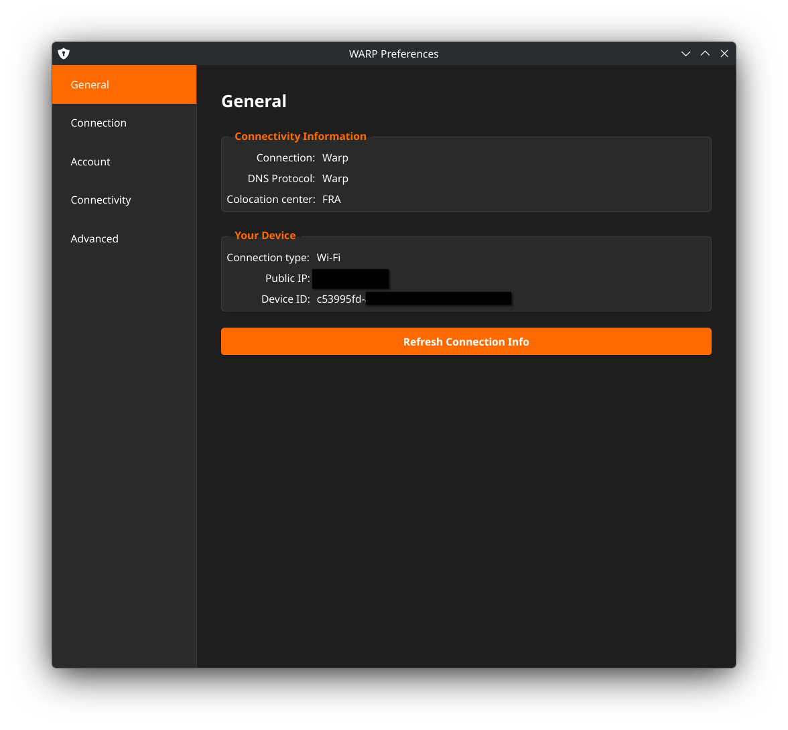
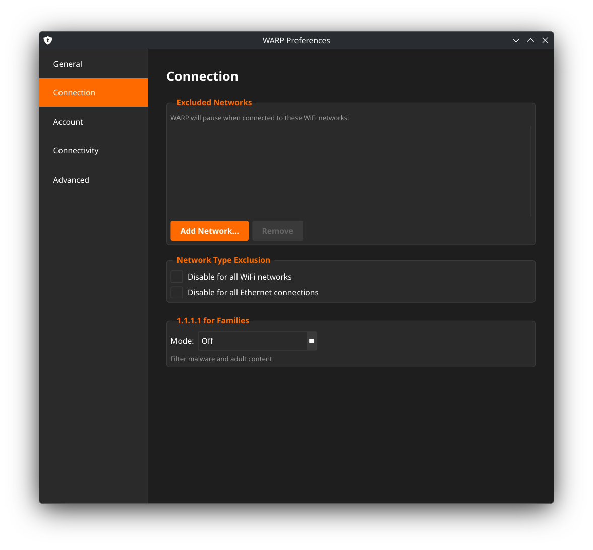
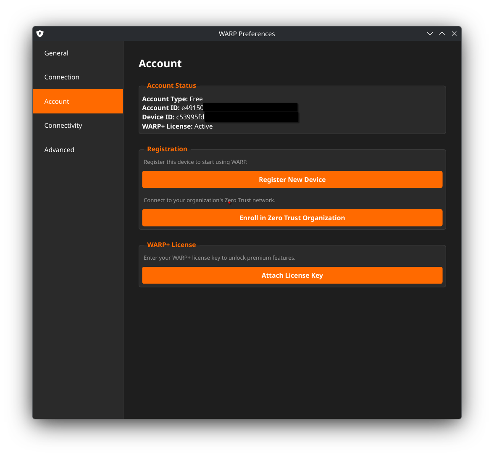
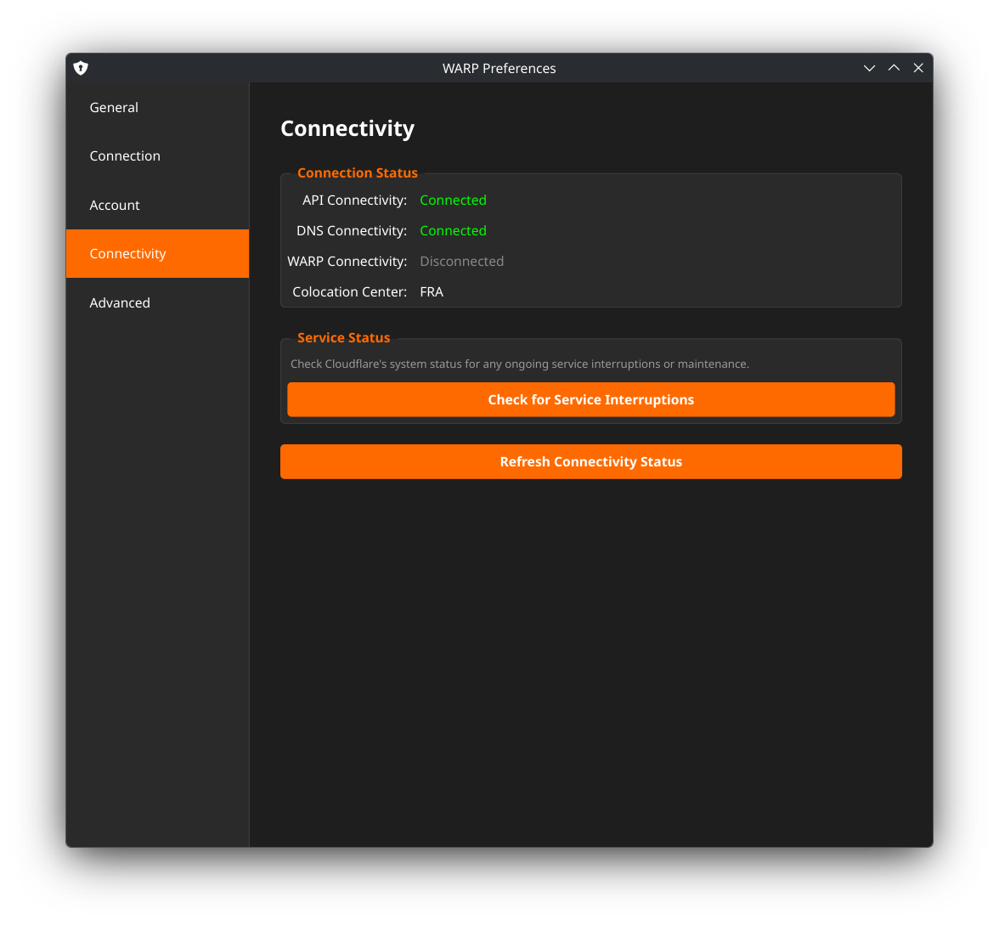

# WARP GUI

> **⚠️ AI-Generated Project Warning**
> This project was created with significant assistance from Claude AI (Anthropic). While functional, the code may contain patterns, implementations, or architectural decisions that reflect AI-generated code. Use at your own discretion and review the code before deployment in production environments.

An unofficial Qt6-based GUI frontend for Cloudflare's WARP CLI on Linux with Wayland support. Designed for KDE Plasma and other Wayland compositors.

## Screenshots

### Main Popup Interface

*Quick connect/disconnect with status display*

### Preferences - General Tab

*Connection information and device details*

### Preferences - Connection Tab

*Network exclusions and DNS settings (shown: consumer mode)*

### Preferences - Account Tab

*Registration, Zero Trust enrollment, and license management*

### Preferences - Connectivity Tab

*API, DNS, and WARP status checks*

> **Note:** You'll need to create a `screenshots/` directory and add actual screenshots of your running application.

## Features

- **System Tray Integration** - Minimize to tray with visual connection status indicators
- **Custom Popup Interface** - Quick access to connection controls with draggable positioning
- **Zero Trust Support** - Full support for Cloudflare Zero Trust (Teams) enrollment
- **Connection Management** - Easy connect/disconnect with status monitoring
- **Mode Switching** - Toggle between WARP and DNS-only modes (consumer accounts)
- **Network Exclusions** - Configure trusted WiFi networks and connection exclusions
- **Split Tunneling** - Manage excluded hosts and IP ranges
- **Comprehensive Preferences** - 5-tab settings dialog:
  - **General** - Connection info, DNS protocol, public IP, device ID
  - **Connection** - Network exclusions, 1.1.1.1 for Families, Gateway DoH
  - **Account** - Registration, Zero Trust enrollment, license management
  - **Connectivity** - API/DNS/WARP status checks, service interruptions
  - **Advanced** - Split tunnels, diagnostics, connection statistics
- **Wayland Native** - Built with LayerShellQt for proper Wayland support
- **Visual Feedback** - Tray icon changes with lock badge when connected

## Prerequisites

### 1. Cloudflare WARP Client

You must install the official Cloudflare WARP client first. The GUI is just a frontend for `warp-cli`.

**On Arch Linux:**
```bash
# Install from AUR
yay -S cloudflare-warp-bin

# Enable and start the service
sudo systemctl enable --now warp-svc
```

**Verify installation:**
```bash
warp-cli --version
```

### 2. Build Dependencies

On KDE Plasma, most Qt6 packages are already installed. Check what you're missing:

```bash
# Check which packages are already installed
pacman -Q base-devel cmake qt6-base qt6-wayland kwindowsystem layer-shell-qt 2>/dev/null

# Install only missing packages
sudo pacman -S --needed base-devel cmake qt6-base qt6-wayland kwindowsystem layer-shell-qt
```

**Note:** `layer-shell-qt` is typically not installed by default and will need to be added. The `--needed` flag skips packages that are already installed.

## Installation

### Building from Source

```bash
# Clone the repository
git clone https://github.com/yourusername/warp-gui.git
cd warp-gui

# Build
cmake -B build
cmake --build build

# Install to /usr/local/bin (optional)
sudo install -Dm755 build/warp-gui /usr/local/bin/warp-gui
```

### Desktop Integration

Create desktop entry for application launcher:

```bash
# Create the file with your text editor
sudo nano /usr/share/applications/warp-gui.desktop
```

Then paste this content:
```ini
[Desktop Entry]
Name=WARP GUI
Comment=Unofficial GUI for Cloudflare WARP
Exec=/usr/local/bin/warp-gui
Icon=network-vpn
Terminal=false
Type=Application
Categories=Network;Qt;
StartupWMClass=warp-gui
```

Or use this one-liner (works in all shells):
```bash
printf '%s\n' '[Desktop Entry]' 'Name=WARP GUI' 'Comment=Unofficial GUI for Cloudflare WARP' 'Exec=/usr/local/bin/warp-gui' 'Icon=network-vpn' 'Terminal=false' 'Type=Application' 'Categories=Network;Qt;' 'StartupWMClass=warp-gui' | sudo tee /usr/share/applications/warp-gui.desktop > /dev/null
```

### Autostart (Optional)

To start WARP GUI automatically on login:

```bash
mkdir -p ~/.config/autostart
cp /usr/share/applications/warp-gui.desktop ~/.config/autostart/
```

## Usage

### Starting the Application

```bash
# Run from terminal
warp-gui

# Or launch from KDE Application Launcher
```

The application will appear in your system tray. Click the tray icon to open the popup interface.

### First Time Setup

1. **Register Device** (if not already registered)
   - Click tray icon → Settings → Preferences
   - Go to Account tab
   - Click "Register New Device"

2. **Connect to WARP**
   - Click tray icon
   - Toggle the switch to ON

3. **Optional: Zero Trust Enrollment**
   - Go to Preferences → Account
   - Click "Enroll in Zero Trust Organization"
   - Enter your organization name
   - Complete authentication in browser

### Keyboard Shortcuts

- **Escape** - Close popup/settings menu
- **Drag** - Click and drag popup title to reposition (position is saved)

### Tray Icon States

- **No badge** - Disconnected
- **Three dots badge** - Connecting
- **Lock badge** - Connected and secured

## Configuration

### WARP CLI Configuration

All WARP settings are managed through the official `warp-cli` tool. The GUI is a frontend that executes `warp-cli` commands.

View current settings:
```bash
warp-cli settings
```

## Project Structure

```
warp-gui/
├── src/
│   ├── main.cpp                  # Application entry point
│   ├── tray_app.{h,cpp}          # Main controller
│   ├── popup_widget.{h,cpp}      # Popup interface
│   ├── settings_menu.{h,cpp}     # Settings dropdown menu
│   ├── preferences_dialog.{h,cpp}# Preferences window
│   ├── toggle_switch.{h,cpp}     # Custom toggle widget
│   ├── warp_cli.{h,cpp}          # WARP CLI wrapper
│   └── wayland_popup_helper.{h,cpp} # Wayland integration
├── CMakeLists.txt
├── CLAUDE.md                     # AI coding instructions
└── README.md
```

## Troubleshooting

### Application doesn't start
```bash
# Check if warp-svc is running
systemctl status warp-svc

# Start if not running
sudo systemctl start warp-svc
```

### Popup doesn't appear / appears in wrong location
- The popup uses Wayland LayerShell protocol
- Position can be customized by dragging the popup window
- On first launch, it appears near your cursor position

### Mode switching options not visible
- This is expected when enrolled in Zero Trust
- Organizations control WARP mode through device profiles
- Consumer mode switching is disabled for security

### Connection issues
```bash
# Check WARP status
warp-cli status

# View detailed diagnostics
warp-cli warp-stats

# Check logs
journalctl -u warp-svc -f
```

## Known Limitations

- **Wayland only** - This GUI is designed for Wayland. X11 support is not tested.
- **KDE optimized** - Built and tested on KDE Plasma. Other DEs may work but are untested.
- **No system service** - The GUI must be running to show tray icon. It does not manage the WARP daemon.

## Contributing

Contributions are welcome! Please note this is an AI-assisted project.

## License

This is an unofficial community project and is not affiliated with or endorsed by Cloudflare, Inc.

The official Cloudflare WARP client is proprietary software owned by Cloudflare, Inc.

## Credits

- Built with **Claude AI** (Anthropic)
- Uses **Cloudflare WARP CLI** (official client required)
- **Qt6** framework
- **KDE Frameworks** (KWindowSystem)
- **LayerShellQt** for Wayland support

## See Also

- [Official Cloudflare WARP Documentation](https://developers.cloudflare.com/warp-client/)
- [Cloudflare WARP Linux Client](https://pkg.cloudflareclient.com/)
- [Zero Trust Documentation](https://developers.cloudflare.com/cloudflare-one/)
